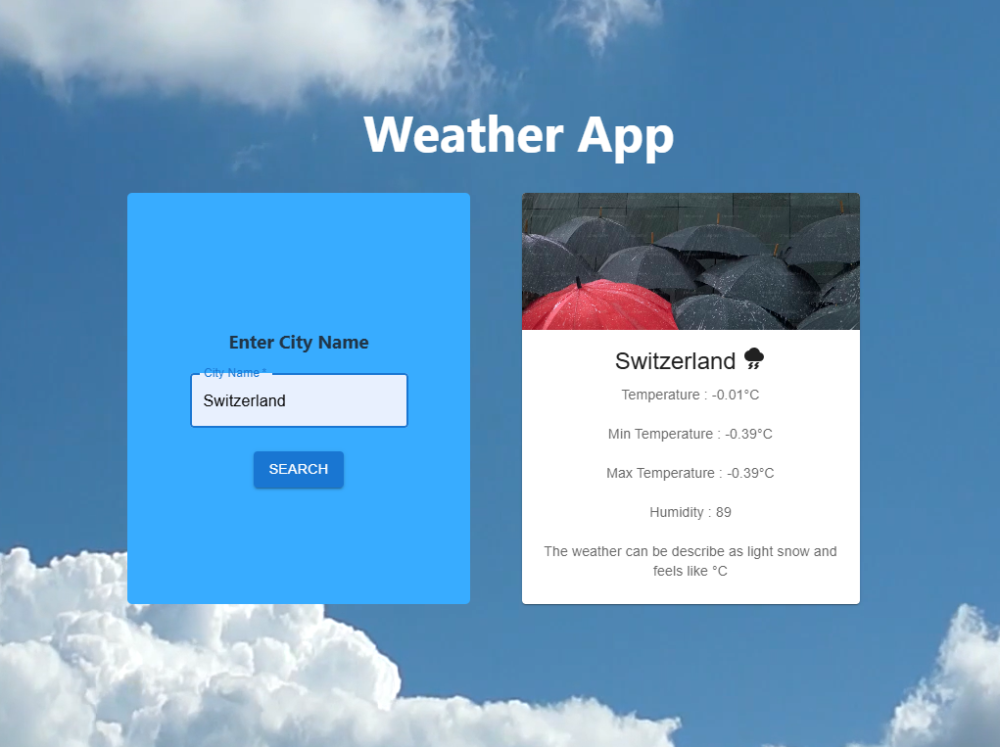

# 🌦️ Weather App

A modern **React.js Weather Application** that fetches and displays real-time weather data using API integration. The app provides a clean, responsive, and user-friendly interface to check current weather conditions for any city.

---

## 📸 Preview

---

## 🚀 Features

- Search weather by city name  
- Displays temperature, humidity, and weather conditions  
- Real-time weather data using OpenWeatherMap API  
- Error handling for invalid city names  
- Clean and responsive user interface  
- Dynamic data update without page reload  

---

## 🛠️ Technologies Used

- React.js  
- JavaScript (ES6)  
- Material UI (MUI)  
- OpenWeatherMap API  
- HTML5 & CSS3  

---

## 📌 Functionality

Users can enter a city name in the search box, and the application fetches the latest weather data from the API. The app processes the response and displays the current weather details in an organized format. Proper validation and error handling ensure a smooth and seamless user experience.

---

## 🎯 Purpose

This project was developed to practice:

- API Integration  
- React State Management  
- Component-based UI Design  
- Material UI implementation  
- Building real-world frontend applications  

---

## 👨‍💻 Author

**Sangharsh Sawale**  
Information Technology Student  
D. Y. Patil College of Engineering, Akurdi
